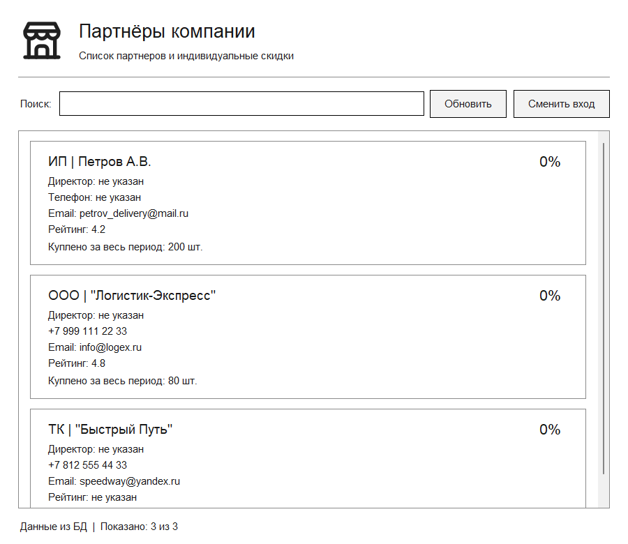

# CRM: партнёры и скидки

Учебное настольное приложение для просмотра партнёров компании и расчёта индивидуальных скидок. Данные хранятся в PostgreSQL, интерфейс написан на Python с использованием Tkinter.

Проект включает проектирование базы в третьей нормальной форме, подготовку и импорт данных, SQL-запросы, бизнес-логику, графический интерфейс и тесты.



## Возможности

- Просмотр карточек партнёров: название, телефон, email, рейтинг и общий объём покупок.
- Автоматический расчёт скидки на основе количества купленной продукции за весь период.
- Поиск по названию и обновление данных из базы.
- Отображение партнёров без продаж со скидкой 0%.
- Обработка ошибок подключения с возможностью повторного входа.
- Загрузка данных в фоновом потоке без блокировки окна.
- SQL-запросы для списка партнёров, создания тестовой отгрузки и просмотра истории реализации.

## Технологии

| Компонент | Технология |
|---|---|
| Язык | Python 3.10+ |
| Интерфейс | Tkinter / ttk |
| База данных | PostgreSQL 18 |
| Драйвер PostgreSQL | Psycopg 3 |
| Тестирование | pytest |
| Измерение покрытия | coverage.py |

Зависимости перечислены в [requirements.txt](requirements.txt). Tkinter входит в стандартную поставку Python для Windows при установке компонента Tcl/Tk.

## Структура проекта

```text
hexlet/
├── 1_businessLogic/          # Функция расчёта скидки и граничные тесты
├── 2_database_integration/   # Подключение к БД и получение данных партнёра
├── 3_partner_ui/             # Первый вариант экранной формы
├── 4_final_app/              # Финальное приложение
│   ├── main.py              # Запуск окна
│   ├── app.py               # Карточки, поиск и управление загрузкой
│   ├── database.py          # Подключение к PostgreSQL
│   ├── database.ini         # Параметры подключения без пароля
│   ├── partner_service.py   # Запросы и объединение данных со скидкой
│   ├── partner_discount.py  # Алгоритм скидки
│   ├── errors.py            # Сообщения об ошибках
│   ├── presentation.py      # Форматирование данных
│   ├── theme.py             # Шрифты и цвета
│   ├── resources/           # Логотип и иконка приложения
│   ├── tests/               # Тесты логики, БД и интерфейса
│   ├── screenshots/         # Демонстрация работы
│   └── run_final_tests.py   # Запуск финальных проверок
├── data/                    # Подготовка данных и импорт
│   ├── source/              # Исходные файлы
│   ├── cleaned/             # Очищенные CSV
│   ├── quarantine/          # Строки, исключённые из импорта
│   ├── data.sql             # Загрузка через INSERT
│   ├── import.sql           # Загрузка CSV через psql
│   └── checks.sql           # Проверка количества строк, сумм и связей
├── diaram/                  # ER-диаграмма и исходник pgAdmin
├── scripts/                 # DDL-скрипт схемы
├── sql-req/                 # Прикладные SQL-запросы
├── pytest.ini
├── requirements.txt
└── run_app.py               # Основная точка входа
```

## База данных

Схема состоит из четырёх таблиц:

| Таблица | Назначение |
|---|---|
| `partners` | Карточки партнёров и контактные данные |
| `products` | Справочник товаров |
| `deliveries` | Отгрузки: партнёр и дата |
| `delivery_items` | Позиции отгрузок: товар, количество и цена |

Один партнёр может иметь несколько отгрузок, каждая отгрузка — несколько позиций. Товары связаны с позициями отгрузок. Историю продаж представляют таблицы `deliveries` и `delivery_items`.

В схеме используются первичные и внешние ключи, ограничения `NOT NULL`, `UNIQUE` и `CHECK`. ИНН и email партнёра уникальны. Ключ позиции отгрузки составной: `(delivery_id, line_number)`. Цена хранится в `DECIMAL(14,4)`, чтобы сохранить точность исходных сумм.

Наименования партнёров и товаров хранятся отдельно от отгрузок. Итоговые суммы и скидки вычисляются при чтении данных.

- [ER-диаграмма в PDF](diaram/er_diagram.pdf)
- [DDL-скрипт](scripts/schema.sql)
- [Прикладные SQL-запросы](sql-req/queries.sql)

## Подготовка данных

В исходных файлах нормализованы пробелы в названиях, формат телефонов и даты. Отсутствующие необязательные значения сохранены как `NULL`. Дубликаты не обнаружены.

Продажа с ID `104` ссылается на отсутствующего партнёра. Она сохранена в [карантине](data/quarantine/rejected_sales.csv) и не включена в рабочую историю.

После импорта исходных данных ожидаются:

| Таблица | Количество строк |
|---|---:|
| `partners` | 3 |
| `products` | 3 |
| `deliveries` | 4 |
| `delivery_items` | 4 |

Общий объём — **430 единиц**, сумма — **67 000,50**. Проверки находятся в [checks.sql](data/checks.sql).

## Правила расчёта скидки

Скидка зависит от общего количества купленной продукции, а не от стоимости покупок.

| Объём за весь период | Скидка |
|---|---:|
| Менее 10 000 единиц | 0% |
| От 10 000 до 49 999 | 5% |
| От 50 000 до 299 999 | 10% |
| От 300 000 | 15% |

Функция `calculate_partner_discount(total_quantity)` возвращает целый процент: `0`, `5`, `10` или `15`.

Список партнёров загружается одним запросом с `LEFT JOIN`, `SUM(quantity)` и `GROUP BY`. Выражение `COALESCE(SUM(quantity), 0)` обеспечивает нулевой объём при отсутствии продаж. Дополнительно Python обрабатывает `None` перед расчётом скидки.

## Запуск приложения

### 1. Подготовка базы

Если база уже создана и данные импортированы, переходите к настройке приложения.

Для новой установки в pgAdmin:

1. Создайте пустую базу, например `partner_shipments`.
2. Откройте Query Tool именно для этой базы и выполните [schema.sql](scripts/schema.sql).
3. Выберите один способ загрузки: выполните [data.sql](data/data.sql) через Query Tool либо импортируйте CSV через мастер pgAdmin.
4. Выполните [checks.sql](data/checks.sql) и сравните результаты с таблицей выше.

При импорте CSV соблюдайте порядок: `partners` → `products` → `deliveries` → `delivery_items`. Для каждой таблицы выберите одноимённый файл из `data/cleaned`. Настройки: формат CSV, UTF8, заголовок включён, разделитель — запятая, Quote и Escape — двойная кавычка. После мастера выполните три запроса `SELECT setval(...)` из конца `data.sql` для настройки последовательностей ID.

`import.sql` предназначен для psql и запускается из папки `data`. Его команды `\copy` не выполняются в Query Tool pgAdmin.

> `schema.sql` удаляет существующие таблицы вместе с данными. Он нужен для первоначального развёртывания, а не для каждого запуска приложения. Не загружайте одни и те же данные сначала через CSV, а затем через `data.sql`.

### 2. Настройка Python

1. Откройте корень репозитория в VS Code.
2. Установите расширения **Python** и **Python Environments** от Microsoft.
3. Через `Ctrl+Shift+P` выберите **Python: Create Environment**, затем **Venv** и установленный Python.
4. При выборе зависимостей укажите корневой `requirements.txt`.

Для запуска нужен Python с Tkinter. При отсутствии Tkinter добавьте компонент **Tcl/Tk and IDLE** через установщик Python.

### 3. Подключение и запуск

В [4_final_app/database.ini](4_final_app/database.ini) укажите параметры своего сервера:

```ini
[postgresql]
host = localhost
port = 5432
dbname = partner_shipments
user = postgres
```

Имя базы должно совпадать с базой, в которую загружены данные.

Откройте [run_app.py](run_app.py) и нажмите **Run Python File in Terminal**. Окно входа откроется автоматически. После ввода пароля PostgreSQL появятся карточки партнёров. Пароль не записывается в файлы проекта.

Кнопка **«Обновить»** или `F5` повторно загружает данные и пересчитывает скидки. `Ctrl+F` переводит фокус в поиск. Список поддерживает прокрутку и изменение размера окна.

## Тестирование

Запустите [4_final_app/run_final_tests.py](4_final_app/run_final_tests.py) кнопкой Run в VS Code и введите пароль PostgreSQL.

Проверяются:

- граничные значения скидки, включая `9999`, `10000`, `49999`, `50000`, `299999` и `300000`;
- отсутствие продаж, пустая отгрузка, нулевой объём и `NULL`;
- суммирование нескольких позиций за разные годы;
- автоматическая загрузка и отображение данных на форме;
- изменение скидки после обновления объёма покупок;
- поиск, пустой список, ошибки подключения и повторный вход;
- отзывчивость окна и закрытие во время загрузки.

В выполненном проверочном запуске **37 тестов прошли без пропусков**. Покрытие строк и ветвей модулей `partner_discount.py` и `partner_service.py` — **100%**. Этот показатель относится к указанным модулям, а не ко всему интерфейсу.

[Результаты тестов](4_final_app/test_results.txt)

Интеграционные тесты создают временные таблицы в отдельных соединениях. Постоянные данные не изменяются. Пользователю PostgreSQL требуется право создавать временные таблицы. Для UI-тестов необходима графическая среда.

## Демонстрация

Скриншоты получены при работе с отдельной тестовой базой PostgreSQL:

- [Список исходных партнёров](4_final_app/screenshots/01_live_database.png).
- [Партнёр без продаж — 0%, объём 10 000 единиц — 5%](4_final_app/screenshots/02_zero_and_five_percent.png).
- [Обработанная ошибка подключения](4_final_app/screenshots/03_connection_failure.png).

Демонстрационные партнёры не входят в исходный набор для импорта.

## Особенности проекта

- Графический интерфейс предназначен для просмотра данных. Создание тестовой отгрузки и просмотр детальной истории представлены отдельными SQL-запросами.
- В исходной схеме нет ФИО директора, поэтому форма показывает «Директор: не указан». Тип партнёра выделяется только из явного префикса его названия.
- Рейтинг сохраняет исходную шкалу 0–5.
- После выполнения учебной транзакции из `queries.sql` количество строк становится 4/4/5/5. Повторное добавление того же тестового партнёра отклоняется ограничением уникальности ИНН.
- Предыдущие этапы находятся в папках `1_businessLogic`, `2_database_integration` и `3_partner_ui`. Для запуска итоговой версии используется корневой `run_app.py`.

## Ресурсы

Временный знак приложения — иконка **Building Store** из [Tabler Icons](https://github.com/tabler/tabler-icons), распространяемая по [лицензии MIT](https://github.com/tabler/tabler-icons/blob/main/LICENSE). Фирменный логотип компании не предоставлен. Изображения находятся в `4_final_app/resources` и могут быть заменены с сохранением имён файлов.
